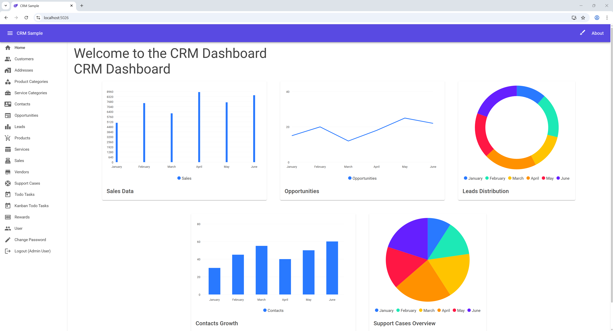

---

<br/>
<p align="center">
  <a href="https://github.com/donpotts/MudBlazorCrmApp">
    
  </a>

  <h1 align="center">MudBlazor CRM</h1>

  <p align="center">
    A comprehensive, enterprise-ready CRM application built with Blazor WASM and .NET 9, showcasing modern web development best practices.
    <br />
    <a href="#-getting-started"><strong>Get Started »</strong></a>
    <br />
    <br />
    <a href="https://github.com/donpotts/MudBlazorCrmApp/issues">Request Feature</a>
  </p>
</p>


---



---

## 🚀 About The Project

MudBlazorCrmApp is a full-featured Customer Relationship Management (CRM) system designed as both a production-ready application and a learning resource for developers. Built on the latest .NET 9 stack, it demonstrates enterprise patterns and best practices for building modern web applications.

### Why Use This Project?

- **Learning Resource**: Understand how to build real-world Blazor applications
- **Reference Implementation**: Copy patterns for your own projects
- **Starter Template**: Fork and customize for your business needs
- **Best Practices**: See how to structure enterprise .NET applications

---

## ✨ Features

### Core CRM Functionality
- 👥 **Customer Management**: Track companies, contacts, and relationships
- 📈 **Sales Pipeline**: Manage leads, opportunities, and deals through stages
- 🛒 **Product & Service Catalog**: Organize offerings with categories
- 🎫 **Support Cases**: Track customer issues with SLA management
- ✅ **Task Management**: Todo lists and Kanban boards

### Technical Features
- 🖥️ **Modern Frontend**: Single-page application with **Blazor WASM**
- 🎨 **Beautiful UI**: Professional [MudBlazor](https://mudblazor.com/) components
- 🔐 **Secure Authentication**: **ASP.NET Core Identity** with JWT tokens
- 📊 **Interactive Dashboard**: Real-time KPIs and analytics charts
- 🔍 **Advanced Querying**: **OData** for flexible data access
- 📝 **API Documentation**: **Swagger/OpenAPI** integration
- 📋 **Audit Logging**: Track all entity changes with Login/Logout events
- 💬 **Communication Tracking**: Log all customer interactions
- 📤 **Data Export**: CSV export functionality

### Enterprise-Ready
- ✅ Data validation with annotations
- ✅ Proper entity relationships
- ✅ Indexed database queries
- ✅ Rate limiting protection
- ✅ Role-based authorization
- ✅ Automatic timestamp tracking
- ✅ Soft delete support
- ✅ Auditable entities (CreatedBy, ModifiedBy)

---

## 🛠️ Tech Stack

| Technology | Description |
|------------|-------------|
|  | Core application framework |
|  | Frontend C# web framework |
|  | Material Design components |
|  | ORM for data access |
|  | Embedded database |
|  | RESTful API standard |
|  | API documentation |

---

## 📁 Project Structure

```
MudBlazorCrmApp/
├── MudBlazorCrmApp/              # ASP.NET Core Web API (Backend)
│   ├── Controllers/              # API endpoints
│   ├── Data/                     # DbContext and data access
│   ├── Models/                   # Server-side models
│   └── Services/                 # Business logic services
│
├── MudBlazorCrmApp.Blazor/       # Blazor WASM Client
│   └── Program.cs                # Client entry point
│
├── MudBlazorCrmApp.Shared/       # Shared Models
│   └── Models/                   # DTOs and entities
│
└── MudBlazorCrmApp.Shared.Blazor/# Shared Blazor Components
    ├── Pages/                    # Razor pages
    ├── Layout/                   # App layout
    ├── Components/               # Reusable components
    └── Services/                 # Client services
```

---

## 📊 Data Models

### Core Entities

| Entity | Description | Key Features |
|--------|-------------|--------------|
| **Customer** | Companies/accounts | Industry, revenue, account manager |
| **Contact** | People at companies | Email, phone, role, do-not-contact flag |
| **Lead** | Potential customers | Source, score, conversion tracking |
| **Opportunity** | Sales deals | Value, probability, pipeline stage |
| **Sale** | Completed transactions | Products, discounts, payment tracking |
| **SupportCase** | Customer issues | Priority, SLA, resolution tracking |
| **Communication** | Interactions log | Calls, emails, meetings, notes |
| **AuditLog** | Change tracking | Entity changes, Login/Logout events |
| **ActivityLog** | User activity | Authentication and action history |

### Pipeline Stages
- Prospecting → Qualification → Proposal → Negotiation → Closed Won/Lost

### Lead Statuses
- New → Contacted → Qualified → Converted / Disqualified

---

## 🏁 Getting Started

### Prerequisites

- [.NET 9 SDK](https://dotnet.microsoft.com/download/dotnet/9.0)
- [Visual Studio 2022](https://visualstudio.microsoft.com/vs/) with ASP.NET workload
- [Git](https://git-scm.com/)

### Quick Start

```bash
# Clone the repository
git clone https://github.com/donpotts/MudBlazorCrmApp.git

# Navigate to the project
cd MudBlazorCrmApp

# Run the application
dotnet run --project MudBlazorCrmApp
```

Or with Visual Studio:
1. Open `MudBlazorCrmApp.sln`
2. Set `MudBlazorCrmApp` as startup project
3. Press F5 to run

The application will open at `https://localhost:5001`

---

## 🔐 Authentication

### Default Accounts

| Role | Email | Password |
|------|-------|----------|
| **Administrator** | adminUser@example.com | testUser123! |
| **Normal User** | normalUser@example.com | testUser123! |

### Roles & Permissions

- **Administrator**: Full access to all features including user management
- **User**: Access to CRM features (customers, leads, sales, etc.)

---

## 🔌 API Endpoints

### Dashboard API
```
GET /api/dashboard/kpis              # Key performance indicators
GET /api/dashboard/sales-trend       # Sales over time
GET /api/dashboard/lead-sources      # Lead source distribution
GET /api/dashboard/pipeline-stages   # Sales pipeline data
GET /api/dashboard/recent-activity   # Activity feed
GET /api/dashboard/top-opportunities # Top deals
```

### Audit & Activity APIs
```
GET    /api/auditlog                 # Entity change history
GET    /api/auditlog/{id}            # Audit log details
POST   /api/authactivity/login       # Log login event
POST   /api/authactivity/logout      # Log logout event
```

### Core CRUD APIs
```
GET/POST       /api/customer
GET/PUT/DELETE /api/customer/{id}

GET/POST       /api/lead
GET/PUT/DELETE /api/lead/{id}

GET/POST       /api/opportunity
GET/PUT/DELETE /api/opportunity/{id}

... (similar for all entities)
```

### OData Support
All list endpoints support OData queries:
```
GET /api/customer?$top=10&$skip=0&$orderby=Name
GET /api/lead?$filter=Status eq 'New'&$count=true
```

---

## 🎯 Extension Points

### Adding New Entities
1. Create model in `MudBlazorCrmApp.Shared/Models/`
2. Add DbSet to `ApplicationDbContext`
3. Create controller in `MudBlazorCrmApp/Controllers/`
4. Add service methods to `AppService.cs`
5. Create Blazor pages in `MudBlazorCrmApp.Shared.Blazor/Pages/`

### Customization
- **Theming**: Modify `ThemeService` and `ThemesMenu`
- **Dashboard**: Edit `CRMDashboard.razor` for custom widgets
- **Navigation**: Update `NavMenu.razor` for menu structure

---

## 📬 Contact

Don Potts - Don.Potts@DonPotts.com

Project Link: [https://github.com/donpotts/MudBlazorCrmApp](https://github.com/donpotts/MudBlazorCrmApp)

---

## 🙏 Acknowledgments

- [MudBlazor](https://mudblazor.com/) - Amazing Blazor component library
- [Chart.js](https://www.chartjs.org/) - Beautiful charts
- [ASP.NET Core](https://dotnet.microsoft.com/apps/aspnet) - Robust backend framework
